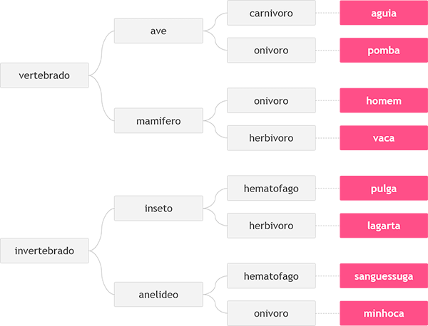

beecrowd | 1049

<h1 align="center">Animal</h1>

Por Neilor Tonin, URI  Brasil

---

## Descrição:
Neste problema, você deverá ler 3 palavras que definem o tipo de animal possível segundo o esquema abaixo, da esquerda para a direita.  Em seguida conclua qual dos animais seguintes foi escolhido, através das três palavras fornecidas.

---

## Entrada:
A entrada contém 3 palavras, uma em cada linha, necessárias para identificar o animal segundo a figura acima, com todas as letras minúsculas.

---

## Saída:
Imprima o nome do animal correspondente à entrada fornecida.

| Exemplos de Entrada | Exemplos de Saída|
|---------------------|------------------|
| vertebrado          |                  |
| mamifero            |  **homem**       |
| onivoro             |                  |
|---------------------|------------------|
| vertebrado          |                  |
| ave                 |    **aguia**     |
| carnivoro           |                  |
|---------------------|------------------|
| invertebrado        |                  |
| anelideo            |    **minhoca**   |
| onivoro             |                  |

