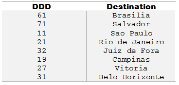

beecrowd | 1050

<h1 align="center">DDD</h1>

Adaptado por Neilor Tonin, URI Brasil

---

## Descrição:
Leia um número inteiro que representa um código de DDD para discagem interurbana. Em seguida, informe à qual cidade o DDD pertence, considerando a tabela abaixo:

Se a entrada for qualquer outro DDD que não esteja presente na tabela acima, o programa deverá informar:
DDD nao cadastrado

---

## Entrada
A entrada consiste de um único valor inteiro.

---

## Saída
Imprima o nome da cidade correspondente ao DDD existente na entrada. Imprima DDD nao cadastrado caso não existir DDD correspondente ao número digitado.

| Exemplo de Entrada | Exemplo de Saída                                               |
|--------------------|----------------------------------------------------------------|
| 11                 |  Sao Paulo                                                     |

